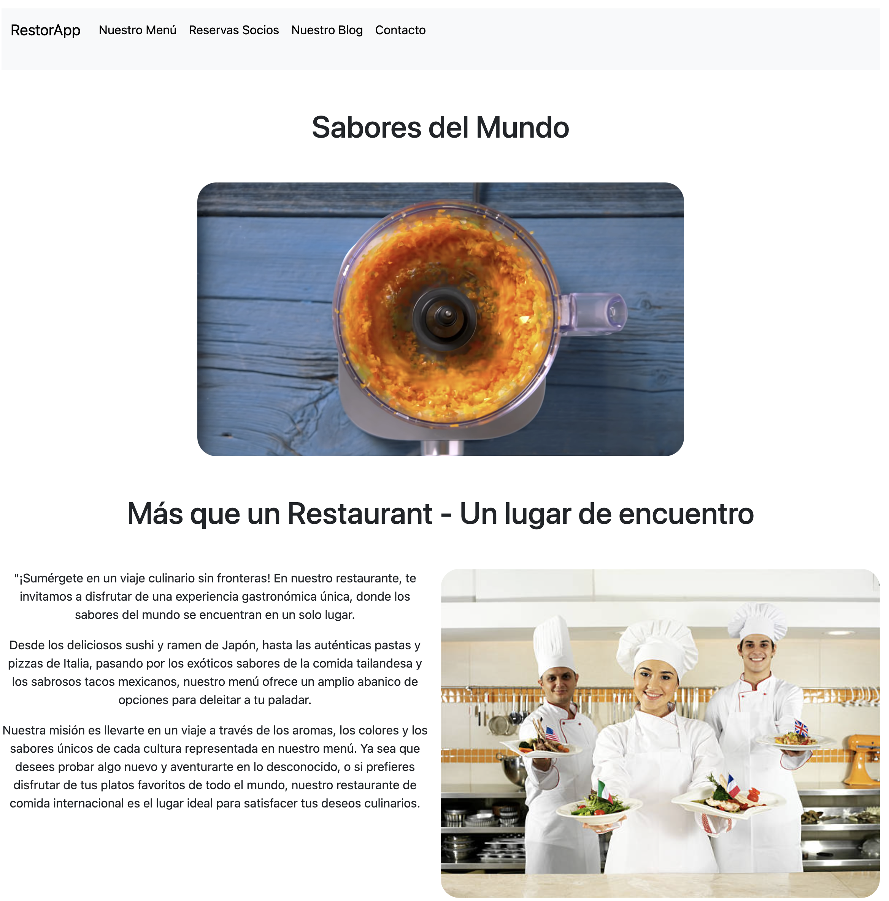
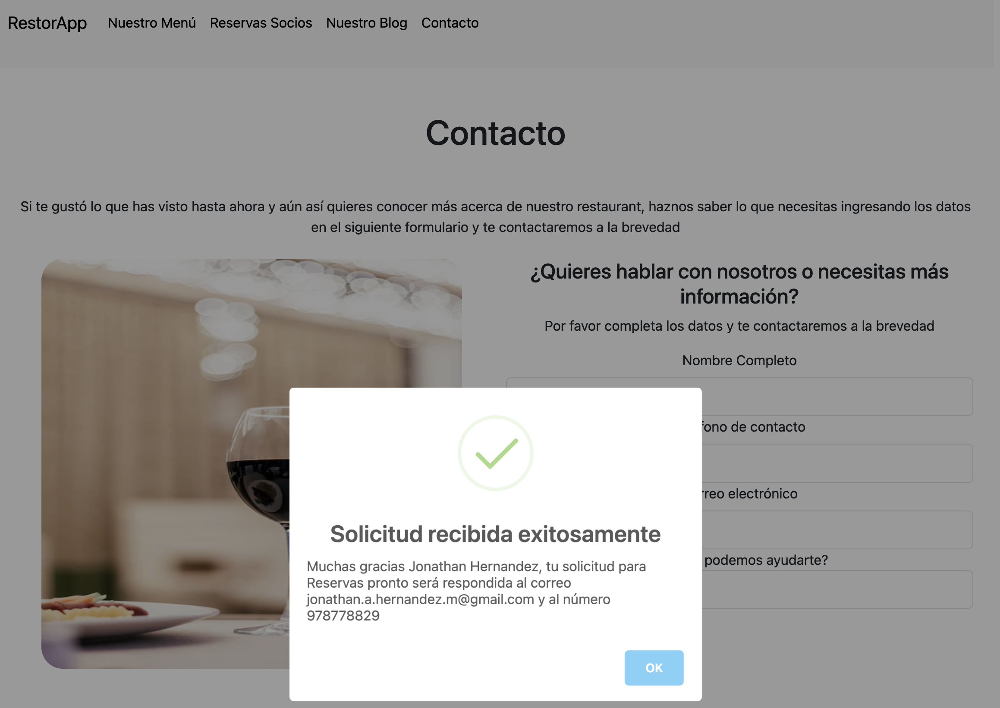
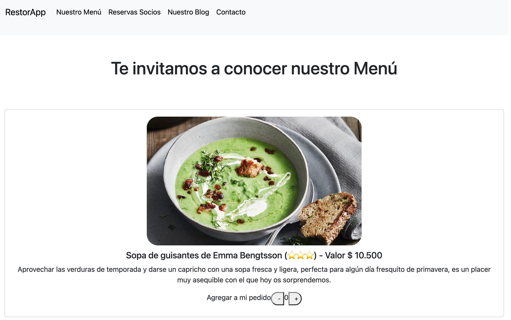
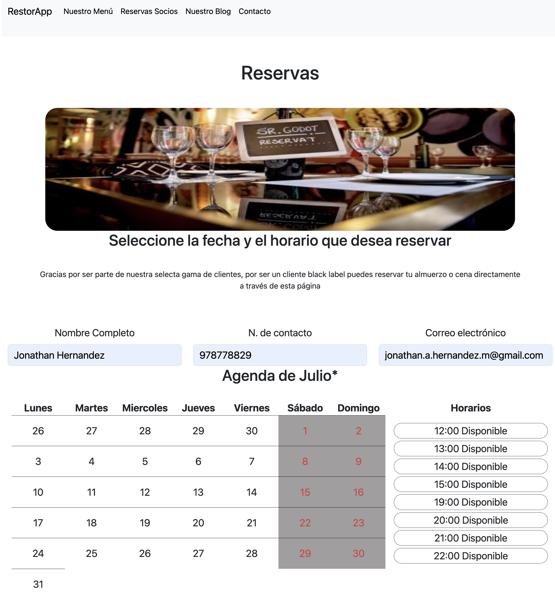

# RestorApp

En este proyecto que sirve como base para aplicación de restaurant se han creado varias secciones con conexión a Firebase, tal es el caso del menú (el que se carga directamente desde el servidor) y la reserva de horas y contacto, que guardan datos en firebase.

## Contenido

1. [Sección Contacto](#Contacto)
2. [Sección Menú](#Menú)
3. [Sección Reservas](#Reservas)
4. [Dudas o sugerencias](#Otros)

## Contacto

Esta sección de la página permite guardar la información de aquellos que te han contactado, de esta manera, podrás mantenerlos siempre informados de las noticias y nuevos menu 

## Menú

En esta sección podrás revisar el menú disponible en para el día y la cantida de pedidos que se han solicitado.

## Reservas

La opción de reservas te invita a completar los datos del usuario para posteriormente desplegar las horas disponibles para le mes actual. (próximamente permitirá seleccionar otras fechas)

## Otros

Tienes dudas de como funciona o quieres conocer más acerca de esta aplicación, puedes enviar un correo a DigitalSolutions@ventas.cl

---
